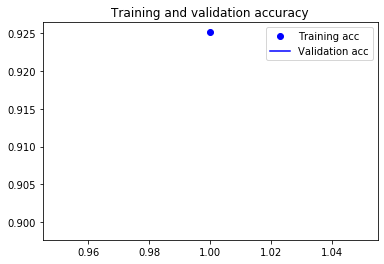
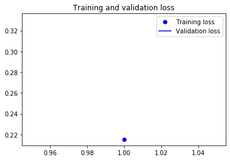

# Assignment 3
## Convolutional Neural Network
### Name: Tyler Cummings
#### NetID: trc119

#### Github Link: 
<https://github.com/Tylrrc/CS4347/tree/master/assign3_convolution_nn>

#### Architecture Details
For this particular project, I chose to utilize the Tesla K80 GPU via Google Colaboratory.

### Experiment Results

##### Note:
The results outlined in this report were obtained by making adjustments to the parameters
of `kerasmain101.py` and `kerasmain101withtrained.py` and then running them in a Google Colaboratory environment
 using Python 3 and GPU hardware acceleration. The particular notebook used to obtain the following results can be found
 [here](https://github.com/Tylrrc/CS4347/blob/master/assign3_convolution_nn/Assn3.ipynb).
 
#### Learning Rate
*   By reducing the learning rate by a factor of 10 (`.0001` to `.00001`), the accuracy was somewhat improved. 
When the learning was `.0001`, the run yielded results with an average of just over 42%. After changing 
the learning rate to `.00001`, the average accuracy rose to just over 53%. 
*   When increasing the learning rate, the average accuracy became considerably worse. Going from a learning
rate of `.0001` to `.0005` resulted in a decrease in average accuracy from just over 42% to less than 10%.

#### Optimizer

##### RMSProp
*   Yields an average accuracy of around 53% with enhancing adjustments to loss function and 
    learning rate.
    
##### Adagrad 
*   Switching to the adagrad optimizer showed minimal improvements in average accuracy over 
    RMSProp (the default optimizer for the project). 
*   *Average accuracy: 55%*

##### Adadelta
*   Yielded comparable results to RMSProp. Used same (optimal) learning rate of `.00001` and a 
    rho of .95.
*   *Average accuracy: 53%*

##### Adam
*   Yielded slightly better results than RMSProp. Used `learning_rate = .00001`, `beta_1 = 0.9`, 
    and `beta_2=0.999`
*   *Average accuracy: 56%*

##### Adamax
*   *Average accuracy: 53%*

##### Nadam
*   Yielded highest average accuracy
*   *Average accuracy: 60%*

#### Epoch
*   Increasing the number of epochs by a factor of 10 (1 --> 10) made a considerable improvement in the 
average accuracy and overall performance didn't suffer too much. However, increasing the epochs 
by an additional factor of 10 yielded the most accurate results yet, at over 93%. Increasing the
number of epochs seems to be inversely proportional to performance, i.e., as the number of epochs
 goes up, the performance goes down. Another negative result of increasing the number of epochs is overfitting to the 
 training data, which will undoubtedly reduce the model's ability to effectively generalize.
*   *Average accuracy: 85%*

#### Train Size
*   Increasing the training size by a factor of 2 saw a sharp increase in overall accuracy, but 
                        increasing beyond that showed minimal improvement.
*   *Average accuracy: 44%*

#### Test Size
*   Smaller test sizes appear to over and underestimate the accuracy of the model. As the test 
set size increases, however, a closer fit can be observed.
*   *Average accuracy: 34%*

#### Final Results

After applying what was determined to be the optimal learning rate, optimizer, epoch, training size, and test size, the 
ultimate results can be observed in the following graphs:

##### Accuracy: 92.51%

##### Loss: 21.53%

               